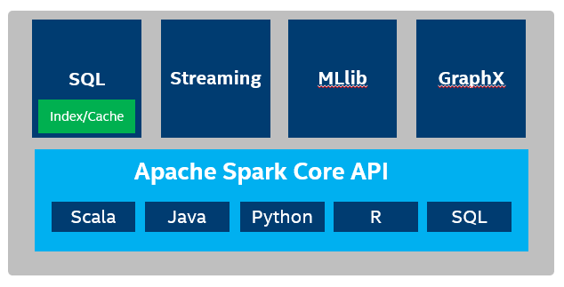
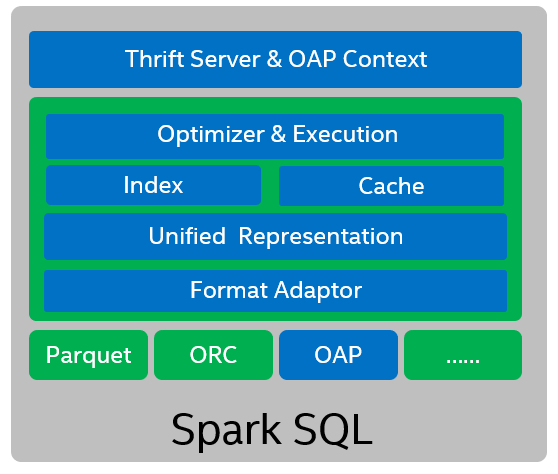

# Architecture Overview


* [Introduction](#introduction)
* [Usage Scenarios](#Usage-Scenarios)
* [Architecture](#architecture)
* [Features](#Features)


## Introduction

Apache Spark is a unified analytics engine for large-scale data processing. Spark SQL* is the most popular component of Apache Spark* , and it is widely used to process large scale structured data in data center. However, Spark SQL still suffers from stability and performance challenges in a highly dynamic environment with ultra large scale data.

SQL Index and Data Source Cache are designed to leverage user defined indices and smart fine-grained in-memory data caching for boosting Spark SQL performance, and can address the performance issues of some use cases.




## Usage Scenarios

### Usage Scenario 1 -- Interactive queries

Most customers adopt Spark SQL as a batch processing engine. Unfortunately, customers would find it hard to separate batch processing and interactive use cases. Interactive queries need to return the data in seconds or even sub-seconds instead of the minutes or hours of batch processing. This is a big challenge for the current Spark SQL implementation.

For example, the following interactive query attempts to filter out a very small result set from a huge fact table.

```
select query, term, userid, planid, unitid, winfoid, bmm_type, cmatch, charge, wctrl, target_url, audience_targeting_tag, is_url_targeting_adv, pluto_idea_type
from basedata.fc_ad_wise
where (event_day='20180701' and query='xxx' and winfoid='65648180412')
limit 10
```

Interactive queries usually process a large data set but return a small portion of data filtering for a specific condition. By creating and storing a full B+ Tree index for key columns and using a smart fine-grained in-memory data caching strategy, we can boost Spark SQL interactive queries to seconds and even sub-seconds.

By properly using index and cache, the performance of some interactive queries can possibly be improved by order of magnitude.

### Usage Scenario 2 -- Batch processing jobs 

Customers usually use Spark SQL for Business Analytics in Data Warehousing. SQL Data Source Cache can speed up batch processing jobs with 2 cache strategies:

1. Automatically cache hot data.
2. Specifically cache hot tables. 

Users can choose either strategy based on their need.

## Architecture

The following diagram shows the design architecture.



SQL Index and Data Source Cache acts as a `.jar` plug-in for Spark SQL.

- We designed the compatible adapter layer for three columnar storage file formats: 

   1. parquet
   2. orc
   3. oap(parquet-like file format defined by OAP).

   SQL Index and Data Source Cache have a ***Unified Cache Representation*** for different columnar storage formats and a fine-grained cache unit for one column of a RowGroup.

- OAP's two major optimization functionalities (indexing and caching) are based on unified representation and the adapter. 
   - Indices can be created on one or multiple columns of a data file. 
   - Currently, Data Source Cache only caches decompressed and decoding data, and will support raw data in the future. Generally, the server's DRAM is used as the cache medium. [DCPMM](https://www.intel.com/content/www/us/en/architecture-and-technology/optane-dc-persistent-memory.html) can also be used as the cache medium as it will provide a more cost effective solution for the requirements of a high performance environment.

- Both indexing and caching as ***Optimizer & Execution*** are transparent for users. See the [Features](#Features) section for details.

- Spark ***ThriftServer***\* is a good use case for OAP, because ThriftServer launches Spark Applications which can cache hot data for a long time in the background, and it also accepts query requests from different clients at the same time. Of course, using bin/spark-sql, bin/spark-shell or bin/pyspark can also use OAP, but usually only for interactive test situations.

## Features

Use indexing and caching to improve Spark SQL performance on ad-hoc queries and batch processing jobs.

### Indexing

Users can use SQL DDL(create/drop/refresh/check/show index) to use indexing. Once users create indices using DDL, index files mainly composed of index data and statistics will be generated in a specific directory. When queries are executed, analyzing index files for boost performance is transparent to users.

- BTREE, BITMAP Index is an optimization that is widely used in traditional databases. We also adopt these two index types in the project. BTREE indexing is intended for datasets that have a lot of distinct values, and are distributed randomly, such as telephone numbers or ID numbers. BitMap index is intended for datasets with a limited total amount of distinct values, such as state or age.

- Statistics are located in the Index file, after all the index data are written into the index file. Sometimes, reading indices could bring extra cost for some queries. So we also support four statistics (MinMax, Bloom Filter, SampleBase and PartByValue) to help filter. With statistics, we can make sure we only use indices if we can possibly improve the execution.

### Caching

Caching is another core feature of OAP. It is also transparent to users. Data Source Cache can automatically load frequently queried (hot) data, and evict data automatically according to the LRU policy when cache is full. Data Source Cache has the following characteristics:

- Off-Heap memory. The Data Source Cache uses off-heap memory and avoids the JVM GC. It can also use [DCPMM](https://www.intel.com/content/www/us/en/architecture-and-technology/optane-dc-persistent-memory.html) as high-performance, high-capacity, low-cost memory
- Cache-Locality. Data Source Cache can schedule computing tasks to the executor which holds needed data in cache, by implementing a cache aware mechanism based on Spark driver and executors communication.
- Cache granularity. A column in one RowGroup (equivalent to Stripe in ORC) of a column-oriented storage format file is loaded into a basic cache unit which is called a "Fiber" in OAP.
- Cache Eviction. Data Source Cache cache eviction uses LRU policy, and automatically caches and evicts data transparently to end user.
- Cache configured tables. Data Source Cache also supports caching specific tables by configuring items according to actual situations, these tables are usually hot tables.


