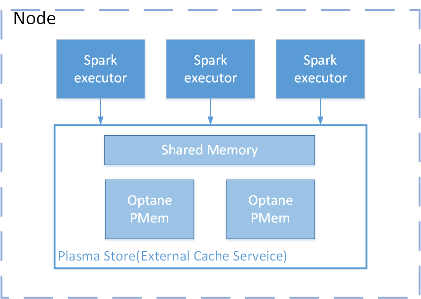

# OAP- How to use Plasma as cache
## Introduction
- OAP use Plasma as a node-level external cache service, the benefit of using external cache is data can be shared across process boundaries. [Plasma](http://arrow.apache.org/blog/2017/08/08/plasma-in-memory-object-store/) is a high-performance shared-memory object store, it's a component of [Apache Arrow](https://github.com/apache/arrow). We have modified Plasma to support Intel Optane PMem, and open source on [Intel-bigdata Arrow](https://github.com/Intel-bigdata/arrow/tree/oap-master) repo. Plasma cache Architecture shown as following figure. A Spark executor contains one or more Plasma client, clients communicate with Plasma Store server via unix domain socket on local node, data can be shared through shared memory across multi executors. Data will be cached in shared memory first, and plasma store will evict data to Intel Optane PMem since PMem has larger capacity.   
 



## How to build
### what you need 
To use optimized Plasma cache with OAP, you need following components:  
    1. libarrow.so, libplasma.so, libplasma_jni.so: dynamic libraries, will be used in plasma client.   
    2. plasma-store-server: executable file, plasma cache service.  
    3. arrow-plasma-0.17.0.jar: will be used when compile oap and spark runtime also need it. 
    
    i and ii will provided as rpm package, these can be download on link xxx, or try `yum install intel-arrow-0.17.0`   
    And iii will be provided in maven central repo, you need add xxx config     
    //TODO: binary package, multi os/distribution support? update this jar to maven central repository. Maybe need a rename?
   
### build Plasma related files manually
1. so file and binary file  
  clone code from Intel-arrow repo and run following commands, this will install libplasma.so, libarrow.so, libplasma_jni.so and plasma-store-server to your system path(/usr/lib64 by default). And if you are using spark in a cluster environment, you can copy these files to all nodes in your cluster if os or distribution are same, otherwise, you need compile it on each node.
  
```
cd /tmp
git clone https://github.com/Intel-bigdata/arrow.git
cd arrow && git checkout oap-master
cd cpp
mkdir release
cd release
#build libarrow, libplasma, libplasma_java
cmake -DCMAKE_INSTALL_PREFIX=/usr/ -DCMAKE_BUILD_TYPE=Release -DCMAKE_C_FLAGS="-g -O3"  -DCMAKE_CXX_FLAGS="-g -O3" -DARROW_BUILD_TESTS=on -DARROW_PLASMA_JAVA_CLIENT=on -DARROW_PLASMA=on -DARROW_DEPENDENCY_SOURCE=BUNDLED  ..
make -j$(nproc)
sudo make install -j$(nproc)
```

2. arrow-plasma-0.17.0.jar  
   change to arrow repo java direction, run command, this will install arrow jars to your local maven repo, and you can compile oap-cache package now. Beisdes, you need copy arrow-plasma-0.17.0.jar to `$SPARK_HOME/jars/` dir, cause this jar is needed when using external cache.
   
```
cd $ARROW_REPO_DIR/java
mvn clean -q -DskipTests install
```

## How to Run Spark-sql with Plasma

### config files:
you should update config file `spark-default.conf` as follow:

For Parquet data format, provides the following conf options:

```
spark.sql.oap.parquet.data.cache.enable                    true 
spark.oap.cache.strategy                                   external
spark.sql.oap.cache.guardian.memory.size                   10g      # according to your cluster
spark.sql.oap.cache.external.client.pool.size              10
```

For Orc data format, provides following conf options:

```
spark.sql.orc.copyBatchToSpark                             true 
spark.sql.oap.orc.data.cache.enable                        true 
spark.oap.cache.strategy                                   external 
spark.sql.oap.cache.guardian.memory.size                   10g      # according to your cluster
spark.sql.oap.cache.external.client.pool.size              10
```


#### start plasma service manually
 you can start plasma service on every node as following command
```
plasma-store-server -m 30000000000 -s /tmp/plasmaStore -e vmemcache://size:49000000000 &
```    
 plasma config parameters:  
 
```
-m  how much Bytes share memory plasma will use
-s  Unix Domain sockcet path
-e  using external store
    vmemcache: using vmemcahe as external store
    size: how much Bytes external store will use on pmem per numa node
```

#### using yarn start plamsa service
 we can use yarn(hadoop version >= 3.1) to start plasma service, you should provide a yaml file like xxx.

### start Saprk-sql and run workload.
 
  
  
  